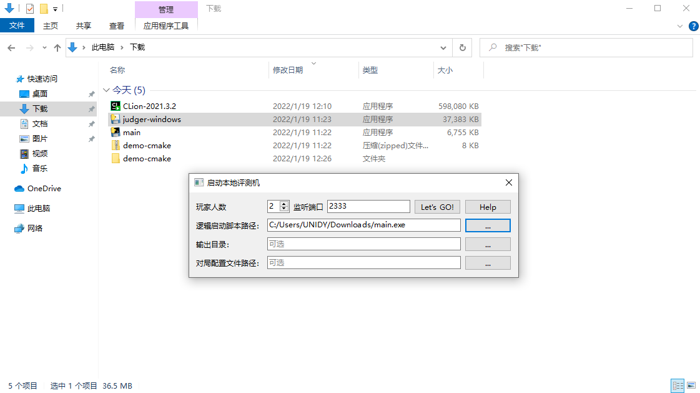
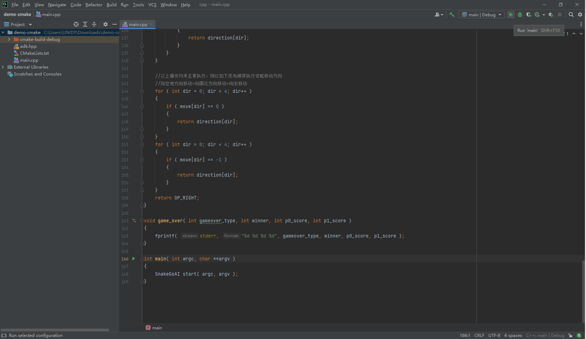

## 准备工作

从[官网](https://www.jetbrains.com/clion/download/)下载安装最新版 CLion。有条件的同学可以使用学校邮箱注册帐号，并申请教育优惠许可证，免费使用 CLion 软件。

打开游戏包，下载游戏逻辑、本地评测工具和 CMake 版样例 AI。

> 以贪吃蛇围棋为例，你需要根据自己的操作系统，下载 `logic-dist/logic` 、`local-judger/judger` 和 `ai/demo-cmake` 。

解压下载下来的 `demo-cmake.zip` ，并使用 CLion 打开项目，等待 CLion 加载完成。如遇对话框，通常点默认选项即可。

## 配置项目

首先，在 0~65535 选择一个端口号。本教程选择了 2333 作为端口号。

> 端口号可能有冲突，因此请尽量避免使用 80、3000 等常见端口号。

打开 CLion 软件，点击右上角的 `main | Debug `下拉菜单，选择 `Edit Configurations` 。

（1）找到 `Program arguments` 一栏，填入 `127.0.0.1 2333` （2333 可替换为你自己选择的端口号）；（2）找到对话框左上角的复制按钮（提示 `Copy Configuration` ），复制一份一样的配置，作为你的另一个 AI 。点击 `OK` 保存。

## 进行评测

打开刚刚下载的本地评测工具（`local-judger`），按 [本地调试工具使用说明](https://docs.saiblo.net/ai/ai.html#_3) 文档 **启动调试工具** 一节所述操作，端口号填你所设定的端口号，逻辑启动脚本路径选择刚刚下载下来的游戏逻辑可执行文件，点击 `Let's GO!` 。

回到 CLion 软件，点击屏幕右上角的运行按钮，即可启动一个 AI 并连入本地评测机。

点击旁边的下拉菜单，选中刚刚设置的另一个 AI 的配置，再次点击运行，即可启动另一个 AI 。

回到本地评测工具，你会发现两个 AI 都已成功连入，且开始评测。

稍等片刻，你就能得到本地评测的结果了！
