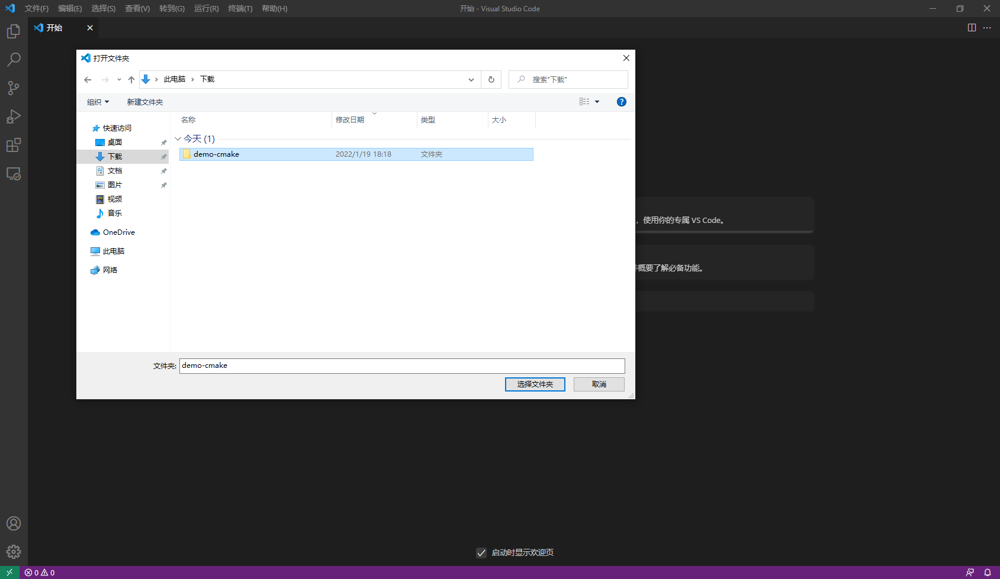
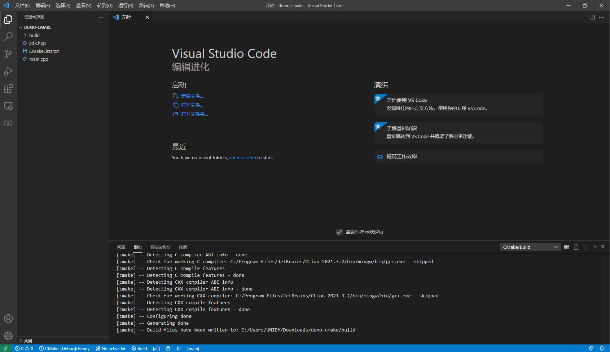
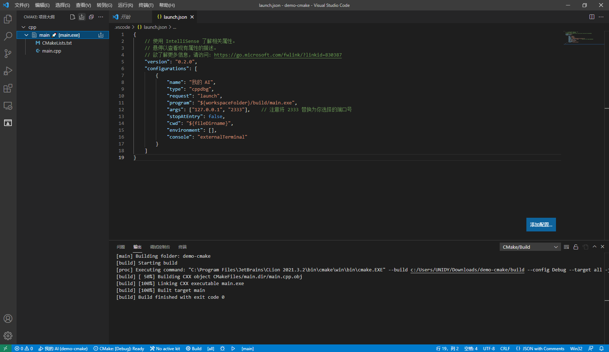
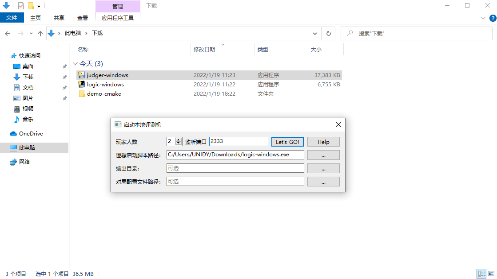
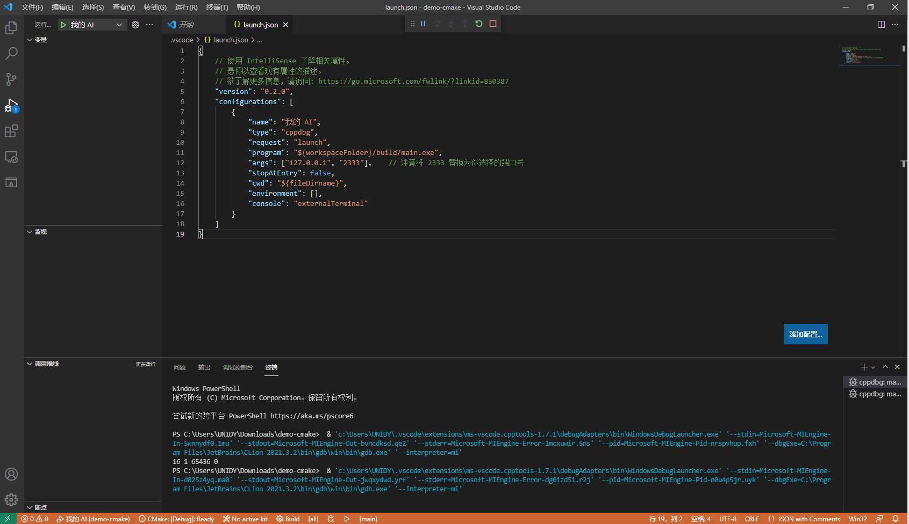
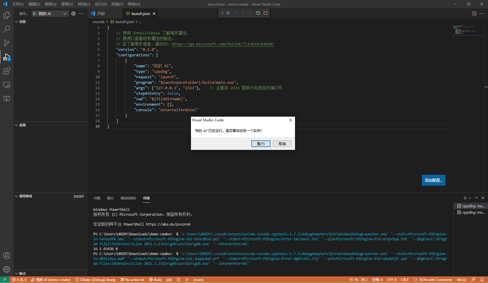

> 阅读该文档之前，我们认为你已经配备好基本的 C++ 环境，本教程将不再赘述。本教程将针对智能体 AI 的本地运行进行展开。

## 准备工作

打开游戏包，下载游戏逻辑、本地评测工具和 CMake 版样例 AI。

> 以贪吃蛇围棋为例，你需要根据自己的操作系统，下载 `logic-dist/logic` 、`local-judger/judger` 和 `ai/demo-cmake` 。


解压下载下来的 `demo-cmake.zip` ，并使用 vscode 打开项目，等待 vscode 加载完成。



正常情况下，打开项目后，**输出**标签页将会给出 CMake 项目初始化的输出，如下所示。



## 配置项目

首先，在 0~65535 选择一个端口号。本教程选择了 2333 作为端口号。

> 端口号可能有冲突，因此请尽量避免使用 80、3000 等常见端口号。

打开 vscode，创建 `launch.json` 。一个示例如下。

```json
{
    // 使用 IntelliSense 了解相关属性。 
    // 悬停以查看现有属性的描述。
    // 欲了解更多信息，请访问: https://go.microsoft.com/fwlink/?linkid=830387
    "version": "0.2.0",
    "configurations": [
        {
            "name": "我的 AI",
            "type": "cppdbg",
            "request": "launch",
            "program": "${workspaceFolder}/build/main.exe",
            "args": ["127.0.0.1", "2333"],    // 注意将 2333 替换为你选择的端口号
            "stopAtEntry": false,
            "cwd": "${fileDirname}",
            "environment": [],
            "console": "externalTerminal"
        }
    ]
}
```

找到 **CMake** 标签页，**生成所有项目**。

> 注意：每次修改代码之后，开始评测之前，都应重新生成，相当于编译。



## 进行评测

打开刚刚下载的本地评测工具（`local-judger`），按 [本地调试工具使用说明](https://docs.saiblo.net/ai/ai.html#_3) 文档 **启动调试工具** 一节所述操作，端口号填你所设定的端口号，逻辑启动脚本路径选择刚刚下载下来的游戏逻辑可执行文件，点击 `Let's GO!` 。



回到 vscode，进入 **运行** 标签页，点击运行按钮，即可启动一个 AI 并连入本地评测机。



再次点击运行按钮，创建另一个运行实例，即可启动另一个 AI 。



回到本地评测工具，你会发现两个 AI 都已成功连入，且开始评测。

稍等片刻，你就能得到本地评测的结果了！
