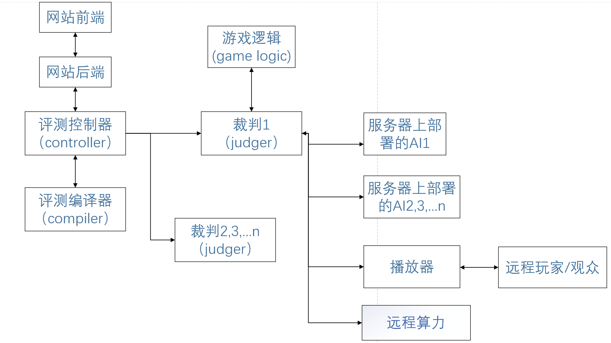
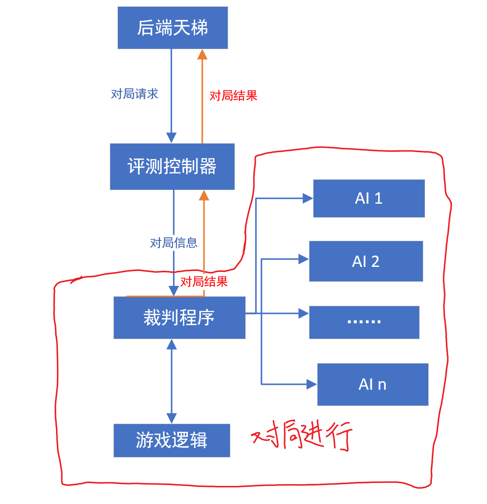

[TOC]

# 游戏开发手册

游戏开发者向平台方提供的完整游戏应包括如下内容：

- 游戏逻辑和逻辑说明文档
- AI SDK和SDK说明文档
- 播放器和播放器说明文档


## 零、平台架构与游戏流程





## 一、游戏逻辑

游戏逻辑方应提供给评测端：启动游戏逻辑的指令，游戏逻辑的可执行文件或者脚本文件

游戏逻辑方应提供给网站：面向用户的逻辑说明文档

游戏逻辑由judger启动进程并通过标准输入输出与judger进行通信，通信协议具体如下：

**有关报文流的报头格式见附录一(提供C++和python的参考写法)(非常重要!!)**

**有关完整游戏逻辑的参考代码见附录二(提供C++和python的参考游戏，内含可以做参考的JSON库)**

**有关Judger源码及启动方式的说明见附录三(judger提供给游戏开发方以方便调试，如果judger设计不能完全满足游戏逻辑开发需求，可自行修改或重写judger和逻辑一并提交)**

**有关Judger的调试模式的说明见附录四**

**具体交互流程如下(非常重要!!)**：

​	1、judger在启动游戏逻辑后，会向游戏逻辑发送初始化信息，格式参见下面`启动游戏逻辑`，格式为$4+n$，有关$4+n$的格式说明参考附录一

​    2、之后judger和游戏逻辑开始交互，交互类型分为以下几种：

- 游戏逻辑向judger发送消息，格式为$4+4+n$，关于该格式说明参考附录一。

  当报头为发送给judger解析的信息时，格式参见`游戏逻辑向judger发送消息`

  当报头为发送给AI的信息时，judger会将$n$对应的消息直接转发给对应的AI

- judger给游戏逻辑发送消息，格式为$4+n$，关于该格式说明参考附录一

  发送消息的内容格式参见`judger向逻辑发送消息`

- **一些重要的说明:** 

  ​		 judger的整体逻辑是回合驱动的，在启动游戏时候任意时刻judger接收到来自AI的消息，judger会判断AI是否在当前回合的listen_list里，如果在，就会把该消息转发给judger并且不会对该信息解析或者异常检测，因此**游戏逻辑有义务对AI发送的信息进行处理**。listen_list及judger转发AI的方式参见`游戏逻辑向judger发送消息`和`judger向逻辑发送消息`

  ​		**在游戏逻辑发送结束消息之前，请务必确保所有操作(尤其是IO操作, 如写入replay文件)结束**

   3、游戏逻辑进程结束会有如下两种情况：

- 游戏逻辑向judger发送游戏结束消息，此时游戏逻辑可以选择自己结束进程，如果没有自己结束，judger会结束游戏逻辑进程
- 游戏逻辑出现问题，出现的问题包括逻辑进程崩溃、逻辑进程发送给judger解析的消息解析失败、逻辑进程发送给judger解析的消息有代码逻辑上的错误，此时judger会进行异常处理，结束逻辑进程和所有的AI进程。

### 1. 启动游戏逻辑

**在judger启动游戏逻辑后，会向逻辑发送JSON格式消息如下例：**

```json
{"player_list": [1, 0, 2],
 "player_num": 3,
 "config": "OMG"
 "replay": "usr/bin/replay.json"}
```

上例表示游戏一共有3名玩家，其中0号玩家为本地AI或者远程算力连接，1号玩家未正常启动进程，2号玩家是远程连接播放器。

对于`player_list`，标号意义如下：

* 0: 该玩家进入游戏失败

* 1: 该玩家正常进入游戏，且为评测机本地AI或者远程算力

* 2: 该玩家正常进入游戏，且为远程连接播放器

  `replay`属性表示如果游戏逻辑带有录像文件，则应当写到该路径下。

  `player_num`属性表示参与玩家的数量，与`player_list`列表长度相一致

  `config`属性表示游戏初始配置信息，对于游戏开发者，如果想要进行config相关测试，可以参考judger启动方式(附录三)；如果想要将config在网站上部署，请参考网站相关说明

  

### 2. 游戏逻辑向judger发送消息

**游戏逻辑可以向judger发送的JSON格式消息如下：**

state为标志，当state>0的时候表示回合数，state<0的时候表示结束游戏，state=0的时候表示初始化设置。

#### 初始化消息

**当state = 0时**:

```json
{"state": 0, "time": 3, "length": 1024}
```

定义每个回合的时间限制(time)和可接收玩家的单条消息的最大长度(length)，如果未收到此类设置，则judger默认时间限制为3s，最大长度为2048，有关长度的定义参见附录一

#### 游戏结束消息

**当state < 0时**:

```JSON
{"state": -1, 
 "end_info": "{'0': 0, '1': 1}"
}
```

游戏结束信息end_info的格式定义如下（以游戏玩家有5人为例）：

```json
"{
'0': <score0>
'1': <score1>
'2': <score2>
'3': <score3>
'4': <score4>
}"
```

`score0-4`分别对应0号玩家到4号玩家的分数

#### 正常回合消息

**当state > 0时**:

```JSON
{"state": 233,
 "listen": [0],
 "player": [0, 1],
 "content": ["<消息0>", "<消息1>"]
}
```

表示当前回合是233回合，向0号AI发送消息0，向1号AI发送消息1，本回合只接收0号AI的消息（这里judger会原封不动的向AI转发消息，不会给AI加上长度头，如果有必要加上长度头防止粘包，请在游戏逻辑中实现）


### 3. judger向逻辑发送消息
**judger会向逻辑发送的JSON格式消息如下：**

#### 发送AI消息

```JSON
{"player": 0,
 "content": "<消息0>"}
```

表示0号AI发送了消息0

#### AI异常

当上述协议中`player`属性为-1的时候，即下面的情况：

```json
{"player": -1,
 "content": "<来自judger的消息>"}
```

`content`的格式会有以下两种：

```JSON
"{
 "player": 1,
 "error": 0,
 "error_log": "<错误信息>"
}"
```

```json
"{
 "error": 1,
 "player": 233,
 "error_log":"<错误信息>"
}"
```

**当error=0的时候**表示AI异常退出，player表示异常退出的AI的编号**(从0开始)**，error_log表示AI错误信息

**当error=1的时候**表示本回合计时结束，player表示计时结束的回合数，error_log表示AI错误信息

注：judger的计时逻辑只会在state发生变化的时候重置，因此如果逻辑希望和AI有更多交互，例如在黑白棋中AI给逻辑发送消息询问当前可落子点或者在某局面下下到某个位置后局面的变化，逻辑可以通过增加和AI的通信协议的内容来实现，向AI发包的时候只需要state不变化就不会重置计时。


## 二、AI SDK

游戏逻辑方应提供给网站：AI SDK，面向用户的AI SDK说明文档

游戏逻辑和AI的通信协议由游戏开发方制定，judger对此只起到转发功能，游戏逻辑有义务对AI发送过来的消息进行处理（如格式或者类型检查等等）

**有关AI SDK的参考代码见附录五（包含完整的AI SDK和AI SDK说明文档，仅做参考示例）**


## 三、播放器

​	播放器是指让人类可以在图形化界面下与游戏逻辑进行交互的程序。

​	播放器并不是游戏逻辑方在网站上部署游戏时必须提供的组件，但网站支持远程播放器的连接。


### 1. 远程播放器

​	用户在远程播放器上进入一个房间后，即可接入一个对局，并由人类进行游戏操作。在这之中，播放器与评测机会有如下的远程通信：

* 播放器请求进入房间（连接服务器）

* 播放器发送用户的回合操作

* 评测机发送游戏的回合信息

  如无特殊说明，通信的数据均为`json`格式。

#### · 播放器请求建立连接

​	播放器上应当输入一个房间`token`，一个房间的`token`按如下规则生成：

```python
token = JUDGE_IP + ":" + JUDGE_PORT + "/" + ROOM_ID + "/" + USER_NAME + "/" + SEAT
token = Base64.b64encode(token).decode()
```

​	其中`JUDGE_IP`为房间服务器的IP地址，`JUDGE_PORT`为服务器通信端口，`ROOM_ID`为房间编号，`USER_NAME`为播放器用户的用户名，`SEAT`为该播放器对应在房间中的座位号。通常来讲，用户将在网站前端的房间页面获得该`token`。

​	根据该`token`，播放器应作为客户端与`ws://token`建立`websocket`连接，例如：`ws://127.0.0.1:12345/1/player/1`，这表明一个用户名为`player`的用户在房间`1`的位置`1`。

​	在播放器成功与房间建立连接后，应向服务器发送如下消息：

```json
{
    "token": token,
    "request": "connect"
}
```

#### · 播放器发送回合操作

​	播放器在用户进行操作后需要发送回合数据给房间，格式如下：

```json
{
    "token": token,
    "request": "action",
    "content": content
}
```

​	其中`content`为播放器需要发送给游戏逻辑的回合信息，它应当是一个字符串，房间会将`content`原封不动地转发给游戏逻辑。`content`的内容应与游戏逻辑进行约定。

#### · 房间服务器发送回合信息

​	当游戏逻辑出现了新的回合信息（或游戏结束信息）、需要发送给播放器时，房间服务器会发送如下信息：

```json
{
    "request": "action",
    "content": content
}
```

​	其中`content`为游戏逻辑发送给播放器的回合信息，它是一个字符串。`content`的内容应与游戏逻辑进行约定。

### 2. 离线播放器

​	离线播放器理论上不会有任何与网站的交互，具体逻辑应由游戏开发者自行制定。


## 附录一：报文流的报头格式

**注意：在judger和逻辑以及AI SDK的通信中，发送的消息均为bytes类型**

**定义$4+n$的格式如下(该格式用于judger对游戏逻辑发送消息和AI SDK对judger发送消息)：**

为了防止缓冲区粘包，在数据包头用4个byte表示数据包的长度，python的发送数据包的写法可以参考如下代码：

```python
def convert_byte(data_str):
    '''
    传输数据的时候加数据长度作为数据头
    '''
    message_len = len(data_str)
    message = message_len.to_bytes(4, byteorder='big', signed=True)
    message += bytes(data_str, encoding="utf8")
    return message
  
def send_state(state_dict):
    '''
    发送回合信息
    '''
    sys.stdout.buffer.write(convert_byte(json.dumps(state_dict)))
    sys.stdout.flush()
```

python的接收数据包的写法可以参考如下代码：

```python
		read_buffer = sys.stdin.buffer
    data_len = int.from_bytes(read_buffer.read(4), byteorder='big', signed=True)
    data = read_buffer.read(data_len)
```

C/C++接收数据包和发送数据包的写法可以参考游戏逻辑参考代码C++版


**定义$4+4+n$格式如下(该格式用于游戏逻辑向judger发送消息)**:

在数据包头先用4个byte表示数据包的长度(这里的长度为$4+4+n$中的$n$)，再用4个byte表示发送消息的对象，当对象为-1的时候表示该消息需要judger进行解析，当对象不为-1的时候表示要发给的AI的编号，python的发送数据包的写法可以参考如下代码：

```python
def logic_convert_byte(data_str, send_goal):
    '''
    传输数据的时候加数据长度作为数据头
    '''
    message_len = len(data_str)
    message = message_len.to_bytes(4, byteorder='big', signed=True)
    message += send_goal.to_bytes(4, byteorder='big', signed=True)
    message += bytes(data_str, encoding="utf8")
    return message
```

python接收数据包的写法可以参考如下代码：

```python
read_buffer = self.subpro.stdout.buffer
data_len = int.from_bytes(read_buffer.read(4), byteorder='big', signed=True)
send_goal = int.from_bytes(read_buffer.read(4), byteorder='big', signed=True)
data = read_buffer.read(data_len)
```

C/C++接收数据包和发送数据包的写法可以参考游戏逻辑参考代码C++版


## 附录二：完整游戏逻辑的参考代码

**python版本**的游戏为黑白棋：

​	参考代码在reversi-logic/logic_python_SDK.py和reversi-logic/logic.py

​	其中logic_python_SDK是可参考的游戏逻辑SDK

**C++版本的游戏为uno**:

​	参考代码在uno-logic文件夹中


## 附录三：judger源码及启动方式说明

judger源码见judge/judger.py

如果judger不能满足游戏开发者的全部需求，游戏开发者可以自行修改judger.py，在经过人工复核之后部署在评测机上

启动方式说明：

启动指令: **python3 <judger路径> <启动逻辑command> <启动AI 1 command> <启动AI 2 command> …… <逻辑生成replay路径>**

如果启动逻辑或者AI的指令中存在空格，则使用"+"号替代，如python3+logic.py，**因此请在文件命名的时候不要使用"+"。**

启动指令示例:**python3 judger.py python3+logic.py python3+ai_1.py ai_2 replay.json**

其中logic.py和ai_1.py是python脚本，ai_2是可执行文件，录像文件输出到当前目录下的replay.json


## 附录四：judger的调试模式说明

为了方便游戏开发者对游戏开发进行本地调试，judger提供了调试模式：

调试模式的启动指令：**python3 judger.py test_mode**

在启动调试模式后，可以使用**help**指令查看其他所有可以使用的指令，使用**help**指令后的输出结果如下：

```json
For the following <index>, it's an integer belonging to [0, 100)
For the following <command>, if there is ' ' with '+' instead
    example:python3+logic.py
INSTRUCTION SET:
  state:get the AI information that has been started
    example:state
  debug_logic:negate the debug_logic state, you can input 'state' to check debug_logic state
    if your debug_logic state is True, the message from logic will be output in std_out
    example:debug_logic
  debug_ai:negate the debug_ai state, you can input 'state' to check debug_ai state
    if your debug_ai state is True, the message from ai will be output in std_out
    example:debug_ai
  0 <index> <command>:start an AI numbered <index> with <command>
    example:0 0 python3+ai.py
  1 <index> <ip> <port> <room_id>:start a human player numbered <index> connected with <ip>:<port>
    judger can only check index, then it will start a server using <ip>:<port>, you need to make sure <ip>:<port> is right
    example:1 0 0.0.0.0 14285 1
  2 <index>: delete an AI numbered <index>
    example:2 0
  3 <index>: delete a huamn player numbered <index>
    example:3 0
  4 <command> <config> <replay>:start your game with <command>, the meaning of				<config> and <replay> can be found in Game Development Manual when the game is initialized
  	when you use this command(4), you need to make sure all AIs are started and the index is sorted from 0
     after using this command(4) successfully, you cannot use the instrution set until your game is over
     example:4 logic.py my_config replay.json
  5:quit all of the processes and threads
    if you don't use command(4) to start a game, we recommend that you exit with command(5) rather than violently withdraw
    example:5

```

游戏开发者可以使用以上指令与judger进行交互，judger的调试模式会根据游戏开发者体验反馈逐步更新。

在使用调试模式的过程中需要注意的事项如下：

- 指令参数之间以一个空格为分隔，结尾没有空格，格式是严格检测的
- debug_logic模式下judger会在标准输出里输出所有接受到的来自游戏逻辑的消息
- debug_ai模式下judger会在标准输出里输出所有接受到的来自AI的消息
- debug_logic+debug_ai模式下judger会在标准输出里输出以上所有的信息
- 当启动指令4之后，交互模式关闭，并根据之前的debug_logic和debug_ai参数进行输出
- 在启动指令4之前，如果想安全退出交互模式，请使用指令5，强行退出可能会导致进程残留

## 附录五：AI SDK的参考代码

**python版本**的游戏为黑白棋，AI SDK的参考代码见reversi-ai/ai_SDK.py，仅供参考。

**C++版本的游戏为uno**:参考代码在uno-ai文件夹中

