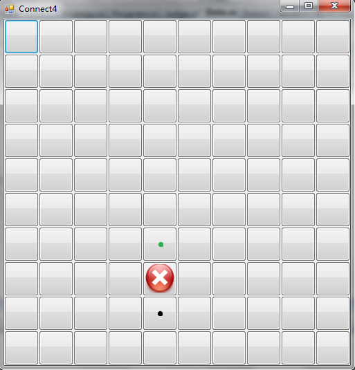

# 四子棋实验指导书

## 关于本实验

在人工智能领域，博弈问题一直以来都是一类具有代表性的研究课题，博弈问题中一些新课题的提出，也不断的推动着人工智能学科的发展。

本实验以四子棋博弈游戏为背景，主要包括了剪枝算法、棋局评价、威胁检测与排除以及同学们自己的创新性算法等方面，主要锻炼大家对人工智能算法的实际应用能力，从而使大家对人工智能有一个更为直观和真切的体会。

## 四子棋游戏介绍

### 基本游戏规则

游戏双方分别持不同颜色的棋子，设 A 持白子，B 持黑子，以某一方为先手依次落子。假设为 A 为先手，落子规则如下：在 $M$ 行 $N$ 列的棋盘中，棋手每次只能在每一列当前的最底部落子，如图中的红点处所示，如果某一列己经落满，则不能在该列中落子。在图形界面中，如果在某一列的任意一个按钮上点击，会自动在该列的最低端落子。

棋手的目标是在横向、纵向、两个斜向共四个方向中的任意一个方向上，使自己的棋子连成四个（或四个以上），并阻止对方达到同样的企图。先形成四连子的一方获胜，如果直到棋盘落满双方都没能达到目标，则为平局。

### 本实验对规则的扩展

如果你查阅一下相关文献和资料，就会发现某些棋盘规模下的四子棋游戏是具有必胜策略的，一个典型的例子是 $6$ 行 $7$ 列棋盘。

在 1987 年，美国计算机学家 [James Dow Allen](http://fabpedigree.com/james/index.htm) 首先提出了该棋盘下的算法策略，在该策略下先手一方可以保证不输，后手一方最多可以拿到平局。仅在几周之后，荷兰计算机科学家 [Victor Allis](http://chessprogramming.wikispaces.com/Victor+Allis) 也宣布独立地完成了四子棋必胜策略的工作并发表了[相关论文](https://oeis.org/A090224/a090224.pdf)。

由于我们实验的评测方法是让大家的策略与己有的样例策略进行对弈，所以如果某一策略完全使用了必胜算法，将造成评测结果没有实际意义，因此我们对规则进行了如下改进：

- **棋盘的大小是随机的，而不是固定不变的，宽度和高度的范围均为 $[9，12]$。**由于并不是所有规模的棋盘都有必胜策略，也不是所有的必胜策略都是先手必胜，所以这里带来了不确定因素。你应该使自己的算法尽可能普适。
- **每次棋盘生成之后，会同时在棋盘上随机生成一个不可以落子的位置，如图中的红叉所示。**当某一次落子是在黑点处时，该列下一次可落子的位置就变为了绿点处，而不再是黑点上面的位置。这样防止同学们在自己的策略中针对每一种棋盘大小分别实现必胜算法，再根据棋盘的实际大小选择对应的算法。

**当然，以上两个小修改的目的并不是完全阻止你研究和使用必胜策略，而是防止你不加思考地使用必胜算法。**实际上，必胜算法的很多思想即使在这两条规则的限制下也是可以发挥作用的，如果你想使自己的策略更加智能、更加有力，就可以学习和研究相关算法，加以吸收和改进，并应用到你自己的策略中，这就需要你发挥自己的创造力了。

## 实验要求

本次实验的实验要求为，在我们提供的实验框架下完成四子棋游戏的人工智能决策部分，并将你的策略文件与我们提供的不同级别的样例策略文件进行对抗。如果你的策略文件能够打败某一级别的样例，就能获得该级别的分数。

该实验推荐的基本方法为 $\alpha-\beta$ 剪枝算法，当然这不是硬性的限制。本实验中大家可以使用任何可能的算法，只要该方法能使你的策略更强大即可。
