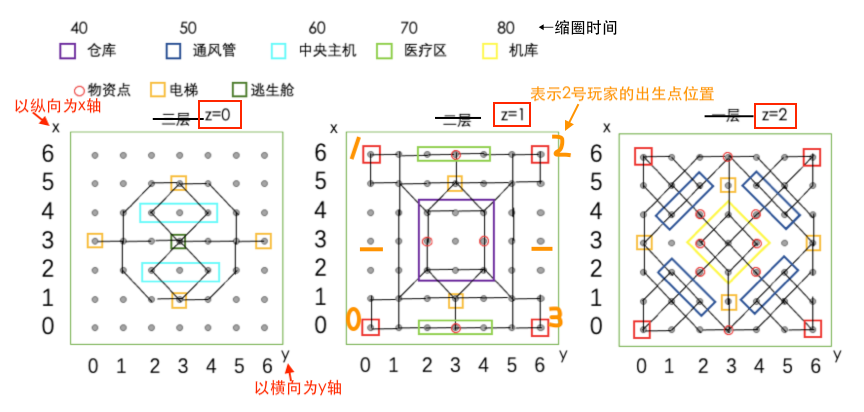

# 回放文件格式说明

### 1. 总体格式

replay文件是json格式，里面存储一个list，list的第一项是一个存储了0-3号玩家出生点位置的list，之后的每一项都是一个存储了一个大回合所有行为的list，list的最后一项是一个score_dict。

对于每个大回合对应的list，其每一项为每个小回合对应所有消息的list，该list可能为空。

replay_example.json给出了一个包含各种情况的replay文件示例。

**附**: score_dict的格式如下（玩家id:得分，分高的赢）：
```json
{
  "0": 4,
  "1": 3,
  "2": 2,
  "3": 1
}
```

### 2. 消息格式

对于每个消息，其总体格式为，

```json
{
    "type" : <str:消息类型>,
    "playerid": <int:玩家序号>  //序号从0开始，根据消息类型，可能不存在这一项
    ...  //其他消息
}
```

**对坐标有如下规定：** 以行数为x，列数为y，规定逃生舱z=0，出生点位于z=1，余下一层z=2。并且以z=0层x-y平面的中心点为原点。用(x,y,z)表示某一点的坐标。

图示如下：



#### 玩家相关

* 移动
```json
{
    "type" : "move",
    "playerid": 1,
    "pos": [1,1,1]
}
```

* 闪现
```json
{
  "type": "flink",
  "playerid": 1,
  "pos": [1, 1, 1]
}
```

* detect
```json
{
  "type": "detect",
  "playerid": 1,
  "tar_pos": [1,1,1]
}
```

* 道具更新
```json
{
     "type": "tool_update",
     "playerid": 1,
     "tools": { 
         "LandMine": 1, //现在持有可用的道具数量
         "Spine": 0,
         "Alert": 0,
         "Sticky": 0,   
         "Kit": 1
     }
}
```

* 攻击
```json
{
     "type": "attack",
     "playerid": 0,
     "attack": [[-1,-1,1], [-1,0,1]]  //[起点坐标，终点坐标]
}
```
**NOTE:** 攻击后必然接血量更新消息，空大不合法。

* 血量更新
```json
{
      "type": "hp_update",
      "playerid": 3,
      "hp": 160  //现在的血量
}
```

* 放置陷阱
```json
{
     "type": "place_trap",
     "playerid": 0,
     "pos": [-1,-1,1],
     "trap_type": "LandMine"
}
```
**NOTE：** 陷阱放置行为不再接tool_update消息，请播放器组自行update

* 使用血包
```json
{
      "type": "kit",
      "playerid": 0,
      "hp": 185 //使用过后的血量
}
```

* 不使用血包的治疗
```json
{
    "type": "cure",
    "playerid": 0,
    "hp": 160  //使用过后的血量
}
```

* 死亡
```json
{
      "type": "died",
      "playerid": 1,
      "box": [3,0,1]     //如果没这一项，说明原来此位置就有一个掉落池了
}
```

* 复活
```json
{
      "type": "regenerate",
      "playerid":1,
      "pos": [3,-3,1]  //复活位置
}
```

* 启动钥匙机
```json
{
      "type": "keymachine",
      "playerid": 0,
      "pos": [-3,3,1]
}
```
**NOTE:** 一般来说，启动钥匙机的下一回合必然出现获得钥匙消息

* 获得钥匙
```json
{
      "type": "getkey",
      "playerid": 0,
      "keyid": [3]   //所取得的钥匙编号list
}
```

* 与逃生舱交互
```json
{
       "type": "escape_capsule",
       "playerid": 0,
       "to_escape": true,    //为true为打开逃生舱，否则为中断逃生倒计时
}
```

* 逃生
```json
{
                "type": "escaped",
                "playerid": 0
}
```

* ai异常
```json
{
  "type": "ai_error",
  "playerid": 1,
  "error_log": "Run_error"  // AI的错误信息，从judger那里传过来的
}
```

#### 场景相关


* 道具检视
```json
{
      "type": "inspect",
      "pos": [-1,-1,1],  //物资点位置
      "playerid": 1,
      "interprops": "Materials", //物资点类型，Box 或者 Materials
 }
```
NOTE: 对于Box，必然后接getkey，对于Material，必然后接tool update

* 陷阱触发
```json
{
      "type": "map_update",
      "args": ["trap_trigger", [-1,-1,1], "LandMine"]  // 后两项为位置和陷阱类型
}
```

* 陷阱destroy
```json
{
      "type": "map_update",
      "args": ["trap_destroy", [-1,-1,1], "LandMine"]  // 后两项为位置和陷阱类型
}
```

* Box消失
```json
{
      "type": "map_update",
      "args": ["box_disappear", [-1,-1,1]]  // 后一项为位置
}
```
