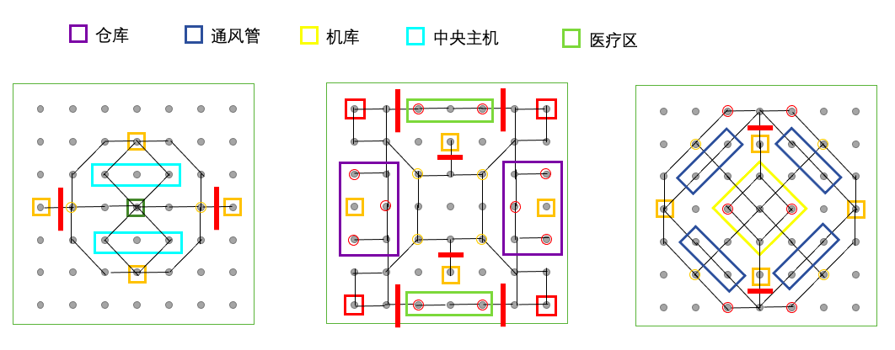

# 失落深空游戏规则介绍

## 基本规则

游戏共有四名玩家，每名玩家将被随机分配到 0-3 的 id，并在每个回合内按照 0-3 的顺序行动。玩家每回合可以执行一次主要行动，也可以无限次使用次要行动。使用次要行动可以在主要行动之前或之后，但一些主要行动会强制结束回合，因此在执行这些行动时
请注意使用次要行动的时机。关于各类行动的机制与效果见‘行动’一节。

游戏中存在 id 为 0-3 的四把密钥，分别对应相同 id 的玩家。玩家在游戏开始时或复活时只拥有与自己 id 相同的密钥。为了取得游戏胜利，玩家必须首先设法取得全部四把密钥。取得密钥的方法包括使用密钥机或拾取掉落物，详细介绍见‘密钥’一节。在取得全部密钥后，玩家需要前往地图上唯一的逃生舱，并在逃生舱处开启逃离倒数。在倒数结束后，玩家将成功逃离并离开游戏。

玩家的角色拥有生命值与道具栏，在被击杀后可以在重生点复活。游戏地图上的一些区域将随着游戏进程的推进在固定回合数失效，失效后的区域将不能再通过。全部区域失效后，游戏将进入加时赛阶段。在此阶段下，玩家死亡后将不会复活，并且以失败状态离开游戏。加时赛持续 30 回合后，若仍有玩家尚未离开游戏，游戏将强制结束，仍存活的玩家也将被记为失败。游戏结束后，将根据‘排名规则‘一节的规则给出四名玩家的相对排名。

## 密钥

编号为 0-3 的四把密钥对应于四名玩家。每名玩家在游戏开始或重生时只拥有自己的密钥。玩家只有集齐全部四把密钥才能启动逃生舱。

地图上每名玩家的出生点与下层对应位置均有一台编号相同的密钥机，若其他玩家进入有密钥机的位置并使用密钥机，就可以获得对应编号的密钥。

当玩家死亡时，所拥有的密钥将掉落并在死亡位置形成掉落物。其他玩家可以前来拾取掉落的密钥，拾取后掉落物将消失。拾取过程中，重复的密钥将会被丢弃，而拾取密钥的玩家将会获得+1 积分。当同一位置有多名玩家死亡时，他们的掉落物将集中在一起。

玩家不能得知其他玩家拥有的密钥情况。

## 排名规则

在游戏结束后，将依据逃脱回合数对四名玩家进行排名。成功逃脱的玩家先于逃脱失败的玩家。在逃脱成功的玩家中，逃脱回合数越靠前的玩家排名越高；在逃脱失败的玩家中，死亡回合数越靠后的玩家排名越高。

若有多个玩家在同一回合逃脱或死亡，则按以下规则计算积分，积分高者靠前：拾取密钥（不论何种方式）每次+1；击杀玩家每次+2；死亡每次-3。若积分相同，则行动顺序靠后的玩家排名靠前。

## 角色

玩家的生命上限为 200，并且在游戏开始和重生时均拥有满生命。损失生命值时，只能通过使用医疗包来回复。玩家可以随时读取自己和同一层内其他玩家的生命值，但不能读取位于其它层内玩家的生命值。

死亡的玩家将在 5 回合后在自己的重生点复活，复活时只持有自己的密钥，并且道具将会清空。在加时赛阶段死亡的玩家不会复活，并且直接记为失败。

## 行动内容

### 主要行动

**攻击(Attack)**：攻击一名和自己在同一位置或与自己直接相邻的敌人，造成 70 伤害。由电梯串联起来的不同层位置不视为直接相邻。

**移动(Move)**：通过一条边到达一个相邻位置。若所在位置有电梯，也可使用电梯移动到地图不同层的对应位置。电梯可以在任意层间直接移动。

**治疗(Heal)**：玩家可以使用一个医疗包，回复 100 生命。若道具栏中没有医疗包则无法执行该操作。

**拾取物品(Collect)**：玩家可从物资点处拾取道具，或从死亡玩家的掉落物处拾取密钥。若一个位置上同时有掉落物和物资点，玩家在一次行动中只能拾取其一。拾取物资点时，如物资点内有物资，则可以从四种道具中任选一种拿取一个；否则，玩家不能获得任何道具。拾取密钥时，玩家获得全部密钥并+1 积分，掉落物消失。

**使用密钥机(GetKey)**：玩家从密钥机上获取一个对应的密钥。若已经持有该密钥，则无法执行该操作。该行动将强制结束回合。

**使用逃生舱(Escape)**：玩家使用逃生舱逃离，若尚未集齐四把密钥则无法执行该操作。执行操作后，玩家停留在逃生舱处并进入两回合倒数，倒数结束后逃离并结束游戏。倒数期间玩家不能执行任何其它操作，但可以随时结束倒数离开。结束倒数也视为主要行动。该行动将强制结束回合。

**终止倒数**：玩家强制停止逃生舱的倒数，恢复可以行动的正常状态。

### 次要行动

**使用探查(Detect)**：检查一个直接相邻的位置，若发现该位置放有其他玩家的陷阱，则揭示并摧毁陷阱。探查技能每次使用后有 5 回合的冷却时间。

**放置陷阱(PlaceTrap)**：玩家在当前位置放置一个陷阱。若玩家物品栏中没有相应种类的陷阱，或者当前位置已经有陷阱（不论种类，不论是否属于自己），则不能执行该操作。

**使用闪现(Blink)**：玩家闪现到同一层内的相邻位置，会触发目标位置的陷阱。若没有闪现道具，则不能执行该操作。

## 逃生舱

地图上只有唯一的一个逃生舱，玩家必须集齐全部四把密钥才能与之互动。在成功使用逃生舱后，玩家将进入两回合倒数状态，处于倒数状态中无法使用次要行动，也不能使用除了终止倒数外的任何主要行动。在每个回合开始时，玩家的倒数-1，相当于在下两个回合的开始时成功逃离。玩家可以主动终止倒数，之后将恢复正常行动的能力。

若玩家在倒数过程中受到攻击死亡，则倒数中断，玩家正常复活。非致命的伤害不会打断倒数。

## 地图

游戏地图分为 3 层，每层是一个 7*7 的点阵，尽管不是每个点都有意义。一些无向边连通了这些点，玩家可以沿边移动。玩家可以通过电梯在不同层间移动。当任意玩家使用电梯到达三层时，所有其他玩家将得到提醒。地图一、二层各有四台密钥机，相同位置的密钥机编号相同。玩家的出生点在二层的密钥机处。

地图上的一些区域被设定为功能区，它们会随着游戏的进程逐渐失效，失效后玩家将不能进入这些区域。若玩家在功能区失效时处于其内部，就会直接死亡。功能区以外的区域属于核心区域，核心区域在整局游戏中始终不会失效。

五个功能区将以上图文字从左到右的顺序依次在第 40，50，60，70，80 回合结束时失效。当全部五个功能区失效后，游戏进入加时赛阶段，此时所有尚在游戏中的玩家将不能复活，已经死亡正在等待复活的玩家（包括在最后一次失效中死亡的玩家）仍可正常复活。在第 100 回合结束时，游戏结束，仍未逃离的玩家将被判定失败。

玩家只能拥有本层的视野，看到同一层中其他玩家的位置、掉落物的位置。当玩家死亡时，视野位置将固定到玩家死亡的位置，直到玩家复活为止。

地图上的物资点初始拥有 2 点物资，每当玩家从中获取一件道具时物资-1，物资为 0 时玩家将不能继续拾取物资。物资点的物资 <2 时，将在 8 回合后回复 1 点物资，直到回满为止。玩家不能在执行拾取前获知物资点内是否有物资。若拾取时未能获得物资，也视为执行了一次主要行动。

## 道具

玩家可持有的道具包括医疗包、闪现和两种陷阱。四种道具的效果如下：

| 名称           | 效果              | 携带数量 |
|--------------|-----------------|------|
| 医疗包(MedKit)  | 回复 100 生命值      | 2    |
| 闪现(Blink)    | 闪现到相邻位置，不能通过电梯  | 2    |
| 地雷(Landmine) | 造成 120 伤害       | 3    |
| 粘弹(Slime)    | 跳过下两回合（本回合和下回合） | 3    |

陷阱会在其他玩家尝试进入布置陷阱的位置时触发，在触发一次后将被摧毁。玩家可以通过探查发现并摧毁其他玩家放置的陷阱。玩家可以获得自己放置的陷阱位置，即使它们不在自己的视野范围内。玩家可以获取现存陷阱的数量与位置，但不能直接得知消失的陷阱是否成功触发、被哪个玩家触发、是否消灭了玩家。玩家不能在逃生舱、密钥机、电梯处放置陷阱。
