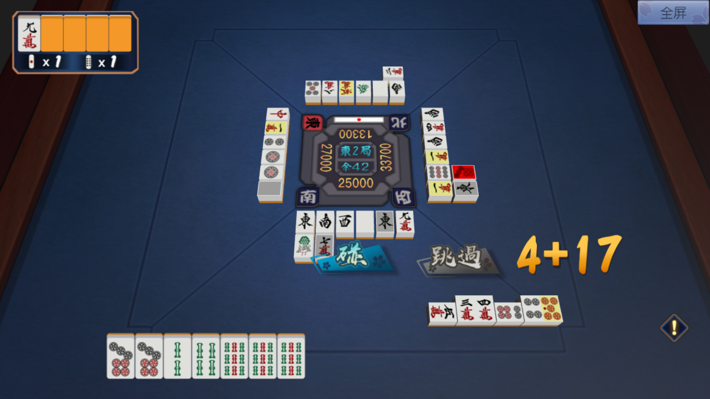
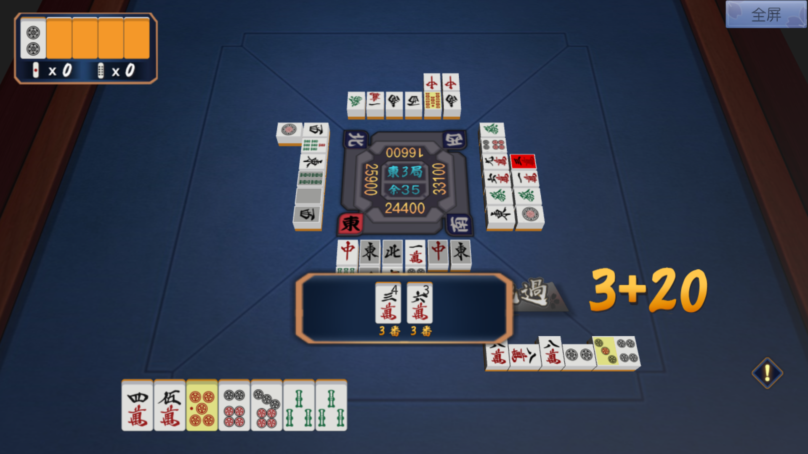
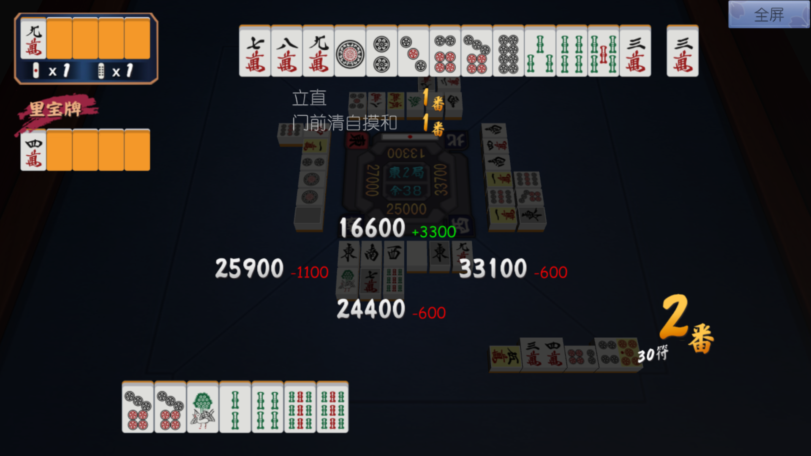
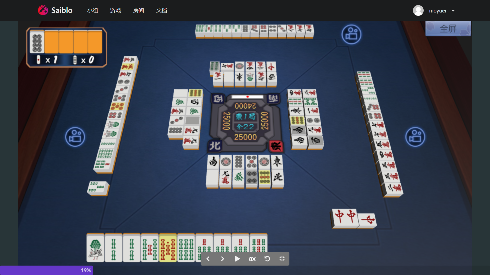

# 播放器使用说明

日本麻将提供网页播放器，支持进行在线对局和观看游戏回放。

日本麻将播放器具有音效。

## 在线模式

在线对局模式的播放器界面如下图所示。

正中间的“东2局”“余42”分别表示该场对局和当前场上余牌数，25000、33700、13300、27000分别表示当前四家点数。北家有一根立直棒，表示北家已立直。牌山不在界面中画出。

四周为牌河，表示四家玩家切出的手牌。牌河外为副露区，展示四家玩家的副露。界面下方为玩家手牌。在线对局模式下，另外三家的手牌不在界面中画出。

界面上“碰“”跳过“等按钮表示当前可执行的操作，“4+17”的字样表示当前操作的倒计时。

左上角五张牌表示宝牌指示牌，其中只有一张已翻开。其下方两个数字1分别表示积棒（立直）场供和本场场供。

场面中一些牌会进行色彩高亮。具体而言：

- 红色——对于鸣牌、荣和等操作，被鸣或放铳的牌会用红色高亮。
- 黄色——宝牌会用黄色高亮。
- 灰色——玩家摸切的牌会用灰色高亮。
- 绿色——用于同牌提示，玩家单击手牌中任意一张牌时，场上所有相同牌均会用绿色高亮。

当玩家听牌时，界面右侧会出现感叹号图标，表示听牌提示。按下听牌提示按钮，界面上会出现听牌提示框，表示所听之牌、和牌番数和场上余张数。

当有玩家和牌时，播放器会展示结算界面。界面上方展示和牌玩家的手牌，其下为所和役种和对应番数。界面中间展示四家点数变动。界面右下方展示和牌玩家所和的番数和符数。如需翻开里宝牌指示牌，界面左侧也会给出相应的展示。

## 离线模式

离线模式播放器用于观看对局回放，其界面与在线模式下的大体相同。

离线模式下，除了主视角玩家的手牌之外，另外三家的手牌也会在界面中展示。点击另外三家的摄像机可以切换主视角。

界面下方有控制回放的按钮，你可以逐帧查看或自动播放。
