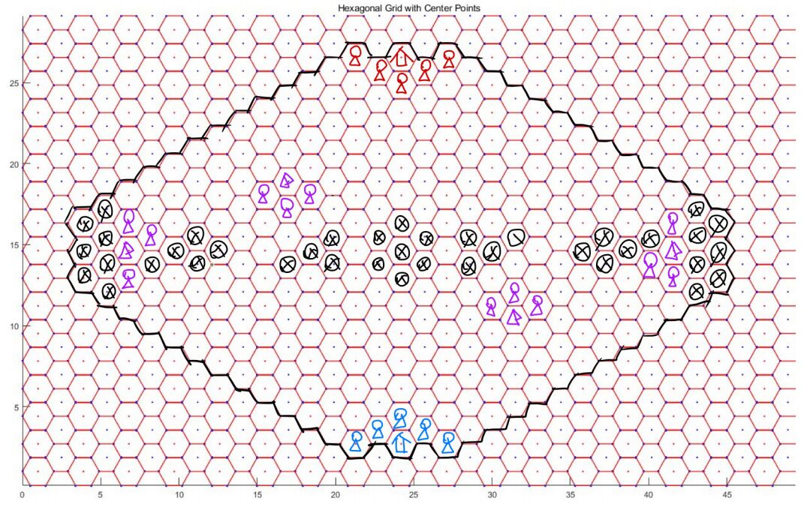

# 神迹之战

## 游戏介绍

神迹之战是一款同时为人类玩家和AI设计的,基于六边形地图的战棋游戏。具有丰富的策略性与趣味性。

## 地图介绍

**要素** ：

- 地图中心对称，但不轴对称

- 双方 **神迹** （红色与蓝色的房屋标志）在地图两侧，拥有5个 **初始出兵点** （红色与蓝色的小人标志）

- 地图上有4处 **驻扎点** （紫色帐篷标志），每个被 **占领** 的驻扎点提供 **3** 个 **额外出兵点** （紫色小人标志）

- 被黑色 ⨂ 标记的格子为 **深渊** ，深渊仅有 **飞行生物** 可以 **经过** 与 **停留

### 神迹

双方 **神迹** 具有 *30* 生命上限，不会恢复

- 神迹不属于 *生物*

- 神迹生命值率先降至 **0** 及以下的一方落败

### 驻扎点

**驻扎点** 默认为中立。

每个回合开始，当一名 **地面生物** 位于一个 **驻扎点** 上方时，该 **驻扎点** 被 该生物所属的一方占领。

**驻扎点** 被 **另一方占领** 前， **驻扎点** 的占领状态不会因为（用于占领的生物离开等）任何因素而改变。

被己方占领的 **驻扎点** 周围的 **出兵点** 视为 **己方出兵点** （**额外出兵点**） 。 

> 即现在，你不再需要一个生物驻守在驻扎点以维持占领状态了。但是与此同时，驻扎点被对手窃取所带来的后果将更加严重。
>
> 不要忘了边角位的驻扎点，现在，利用空闲的生物占据边角位可能带来更大的优势

### 出兵点

**初始出兵点** 和 **额外出兵点** 统称 **出兵点** 。

每回合都可以在 **己方出兵点** 召唤生物，如果某个召唤行为会导致 **生物重叠** ，则不能进行召唤。

- 一个 **己方出兵点** 上如果有一个 **地面生物** （无论敌我），则你不可以在此召唤 **地面生物** ，但你可以在此召唤 **飞行生物** 。反之亦然。

### 深渊

**深渊** 是一种特殊地形。

**地面生物** 无法 **经过** 或 **停留** 在 **深渊** 中~~*（，如果 地面单位 被 强制位移 并停留至 深渊 则立即死亡（但 穿过不会））【暂无强制位移机制】*~~。

**飞行生物** 可以自由 **经过** 和 **停留** 在 **深渊** 中。

## 基本机制

### 游戏流程

#### 确定先后手

随机确定先后手，并告知双方玩家

#### 提交卡组

双方玩家提交自己的卡组，卡组包含 *1* 种 **神器** 和 *3* 种不同 **生物**

> 实际上由于不存在抽卡，可以理解为这些卡一开始就全在手牌里

不合法的卡组直接判负。

#### 对局开始

公布双方卡组 。

进入 **先手玩家** 的回合，之后轮流进行回合。

### 法力值

游戏开始时， **先手玩家** 拥有 *1* **法力上限** ， **后手玩家** 拥有 *2* **法力上限**。

回合开始时：

1. 先手玩家的奇数回合，即总第 *4k+1* 回合， **法力上限** 增大 **1** ；后手玩家的偶数回合，即总第 *4k* 回合， **法力上限** 增大 **1** 

2. 当前玩家 **法力值** 设置为 **法力上限**

> 实际上，先手玩家的第一个回合也会增长法力上限，所以实际上双方玩家前几个回合的法力上限如下表：
>
> | 回合数   | 1    | 2    | 3    | 4    | 5    | 6    | 7    | 8    |
> | -------- | ---- | ---- | ---- | ---- | ---- | ---- | ---- | ---- |
> | 先后手   | 先   | 后   | 先   | 后   | 先   | 后   | 先   | 后   |
> | 法力上限 | 2    | 2    | 2    | 3    | 3    | 3    | 3    | 4    |
>
> 先手在自己的第21回合，总的第41回合到达12法力上限；后手在自己的第20回合，即总的第40回合到达12法力上限。

召唤生物、使用神器都会消耗法力值。

**法力上限** 最高为 **12**

### 冷却

#### 生物

每种生物在加入卡组后会提供若干张 **生物单元** 。

> 生物单元的数量由生物种类决定，如：将剑士编入卡组将获得6张剑士生物单元，而将弓箭手编入卡组将获得3张弓箭手生物单元

每张 **生物单元** 可以被 独立地 消耗，用于一次任意 **星级** 的该种生物召唤。

召唤出的 **生物 死亡** 后，召唤其所消耗的 **生物单元** 会进入 **冷却** ， 冷却结束后才能再次用于召唤。

冷却所需回合数与生物 **种类** 和 **星级** 有关。

在全局第51回合（先手回合）和第76回合（后手回合），双方生物单元数量会得到补充。

> 在生物介绍中，将用 初始/51回合/76回合 的格式描述各次变化后的生物单元数量

#### 神器

**神器-回收** 后进入冷却，冷却结束后可再次使用。

>  **神器-回收** 的相关描述参见 **神器** 条目

**回收** 时机和 **冷却时间** 与神器有关。

### 玩家回合

双方玩家轮流进入 **回合** ，每个回合分为以下阶段：

#### 回合开始

按顺序处理以下事件：

1. 当前玩家 **法力上限** 按规则增大 **0 or 1**

2. 当前玩家 **法力值** 设置为 **法力上限**

3. 当前玩家占领 **驻扎点**

4. 处理描述带有 **回合开始** 的效果

#### 冷却阶段

己方 **生物单元** 和 **神器 剩余冷却时间** 减少 1 。

**剩余冷却时间** 为 0 的 **生物单元** 和 **神器** 变为可用。

#### 主要阶段

在该阶段，玩家可以任意进行以下操作：

- **召唤生物**

- **生物-移动**

- **生物-攻击**

- **神器-使用**

#### 回合结束

处理描述带有 **回合结束** 的效果

### 胜利判定

满足如下条件时，游戏结束：

1. 一方AI回合超时

2. 一方神迹血量小于等于0 

3. 双方完成的回合总数到达 **100**

依次按照以下规则判定胜者：

1. 回合超时的AI判负，其对手获胜

2. 如果没有AI超时，神迹剩余血量更多的一方获胜

3. 如果神迹剩余血量相同，计算所有阵亡的己方生物的 **星级** 之和，阵亡己方生物星级和较小的一方获胜

## 生物

### 生物单元

每张 **生物单元** 可以被 *独立地* 消耗，用于一次任意 **星级** 的该种生物召唤。

召唤出的 **生物 死亡** 后，召唤其所消耗的 **生物单元** 会进入 **冷却** ， 冷却结束后才能再次用于召唤。

冷却所需回合数与生物 **种类** 和 **星级** 有关。

在全局第51回合（先手回合）和第76回合（后手回合），双方生物单元数量会得到补充。

### 星级

**生物** 拥有 **3** 个 **星级** 不同的版本，不同 **星级** 的生物拥有相似的定位和特性，但往往具有不同的 **基本属性** 。

**生物单元** 可以用于任意 **星级** 的该种生物召唤。

### 基本属性

生物拥有6种 **基本属性** —— **法力消耗** 、 **攻击力** 、 **攻击距离** 、 **最大生命值** 、 **最大行动力** 、 **冷却时间** 。

#### 法力消耗

生物 **召唤** 时会消耗等同于 **法力消耗** 的 **法力值** 。

#### 攻击力

决定生物 **攻击** 和 **反击** 造成的 **伤害**

#### 攻击距离

决定生物攻击的范围。在棋盘中，两个格子的 **直线距离** 定义为从一个格子走到另一个格子，无视地形

和生物所需要的最少步数。而 **攻击距离X-Y** 意为该生物能攻击到与其所在格 **直线距离** 在 **X-Y** 范围内的格子上的生物。

**飞行生物** 的 **攻击范围** 包括 **空中层** 和 **地面层** ， **地面生物** 的 **攻击范围** 包含 **地面层** ， 如果有 **对空** 属性，则还包含 **空中层** 。

#### 最大生命值

生物 **生命值** 的最大值， **生物-召唤** 后， **初始生命值** 等于 **最大生命值** 。

受到 **治疗** 后，生命值不会超过最大生命值。

#### 最大行动力

**生物****-****移动** 时，一条 **合法移动路径** 的最大格数。

**地面生物** 计算 **合法路径** 时，不能 **经过** 或 **停留** 于 **其他地面生物** 、**神迹** 、 **深渊** ；不能 **经过** 但能 **停留** 于 **敌方飞行生物** 、 **敌方地面生物周围****1****格** 。

**飞行生物** 计算 **合法路径** 时，不能 **经过** 或 **停留** 于 **其他飞行生物** ；不能 **经过** 但能 **停留** 于 **敌方地面生物** 、 **敌方飞行生物周围1格** 。

**路径** 的格子不包含移动前的位置。

**停留** 的格子即路径的最后一格。

**经过** 的格子不包含最后停留的格子。

**另一种描述方式**：

每个生物 **占据** 某一格的某一层，这使得双方生物都不能经过/停留于该格该层。同时，每个生物 **拦截** 同层的周围6格和同格的另一层，这使得 **敌方生物** 不得经过这些区域，一旦走入就必须停止移动。

> 提示：间断（生物之间间隔1格）防线能很好地阻击敌方同层生物，同时减少需要用到的生物数量和增大攻击面积。但对于非同层生物仅能起到有限的拖延作用。

#### 冷却时间

指 **生物****-****死亡** 后，对应 **生物单元** 重新可用前，需要经历的 **冷却阶段** 数。

### 相关操作

#### 召唤

消耗 **法力值** 和 **对应生物单元** ，在指定位置，召唤一个指定 **种类** 和 **星级** 的生物。

如无特殊 **词条** ，生物 **召唤** 出来的当回合不能 **攻击** 或 **移动** 。

#### 攻击

让一个处于 **可攻击状态** 的 **生物（攻击者）** 对攻击范围内 **敌方生物/神迹（被攻击者）** 发起一次攻击，

造成等同于 **攻击者 攻击力** 的伤害。

如果 **攻击者** 同时也在 **被攻击者** 的攻击范围内， **被攻击者** 会对 **攻击者** 进行 **反击** ，造成等同于 **被攻击者 攻击力** 的伤害。

**攻击力** 为 0 的生物不可 **攻击** 。

如无特殊 **词条** ，一个生物在一个回合内不可以既 **移动** ，又 **攻击** 。

#### 移动

让一个处于 **可移动状态** 的 **生物** 移动到指定地点。

移动时的 **占据** 与 **拦截** 的相关概念，参见 **最大行动力** 一条。

### 死亡

如果玩家的一次指令所引发的事件全部处理完毕后，进行一次 **死亡检索** ，如果存在场上生物 **生命值** 降至 0 或更低，则这样的生物会进入 **濒死状态** 。这些 **濒死** 生物会依次进入 **死亡结算** ——他们的 **亡语** 会被触发，接着模型被删除，召唤他们所用的 **生物单元** 会进入冷却。

生物一旦进入 **濒死状态** ，即使因为其他生物的 **亡语** ，生命恢复到 0 以上，也一样会进行 **死亡结算**。

当所有 **濒死** 生物 **死亡结算** 完成后，进行一轮新的 **死亡检索** ，直到不再有生物生命值为 0 或更低。

### 词条

#### 长词条

##### 触发

达成某种条件时，触发某种效果

##### 光环

对一定范围内满足条件的生物产生持续效果

##### 亡语

死亡时生效的触发效果

#### 短词条

##### 对空

仅 **地面生物** 可能有本词条

可攻击 **攻击范围** 内的 **地面生物** 和**飞行生物**

##### 飞行

是 **飞行生物** ，可攻击 **攻击范围** 内的 **地面生物** 和**飞行生物**

##### 圣盾

抵消受到的第一次伤害，不可叠加

## 神器

### 基本属性

神器拥有基本属性： **法力消耗** 、 **冷却时间** 、 **使用方式** 。

#### 法力消耗

**使用** 神器时需要消耗的 **法力值** 。

#### 冷却时间

神器 **回收** 后直到变为 **可用** 所需经历的 **回合数**。

**回收** 时机由使用方式决定。

### 使用方式

神器有3种使用方式，每个神器的使用方式是固定的。

#### 释放

可以理解为魔法卡，当即使用，产生效果，立即 **回收**

#### 生成

当即使用，产生效果（可能没有即时效果）。

产生效果之后，会在目标地点生成一个 **神器生物** ，被看作 **生物**。

**神器生物** 死亡后， **神器** 才 **回收** 。

#### 装备

以 **友方生物** 为目标使用，使用后为目标生物增加 **属性** 和 **词条**

装备神器的生物死亡后， **神器回收**

## 卡牌一览

### 生物

> 以下用 初始/51回合/76回合 的格式描述各次变化后的生物单元数量

> 费用/攻击/生命/最小范围-最大范围/行动力/冷却

#### 剑士

- 生物单元数量：6/7/8

**L1**

- 2/2/2/1-1/3/2

**L2**

- 4/4/4/1-1/3/2

**L3**

- 6/6/6/1-1/3/3

#### 弓箭手

- 生物单元数量： 3/4/5

**L1**

- 2/1/2/3-4/3/4

- **对空**

**L2**

- 4/2/3/3-4/3/4

- **对空**

**L3**

- 6/3/4/3-4/3/4

- **对空**

**黑蝙蝠**

- 生物单元数量：3/4/5

**L1**

- 2/1/1/0-1/4/3

- **飞行**

**L2**

- 3/2/1/0-1/4/3

- **飞行**

**L3**

- 5/4/2/0-1/5/4

- **飞行**

**牧师**

- 生物单元数量：3/4/4

**L1**

- 2/0/3/0-1/5/3

- 触发 ： **己方回合结束** 时，(范围2) **友方生物** 回复 1 生命

- 光环 ： (范围2) **其他友方生物** +1 攻击力 

**L2**

- 4/0/4/0-1/5/3

- 触发 ： **己方回合结束** 时，(范围3) **友方生物** 回复 1 生命

- 光环 ： (范围3) **其他友方生物** +1 攻击力 

**L3**

- 7/0/6/0-2/5/5

- 触发 ： **己方回合结束** 时，(范围3) **友方生物** 回复 1 生命

- 光环 ： (范围3) **其他友方生物** +1 攻击力 

> **注意**： **攻击力** 为 0 的生物不可 **攻击** 。
>
> 虽然牧师攻击力仍然为0，但当多个牧师彼此靠近时，他们将有一定的近战和对空反制能力，必要时可以进行少量输出
>
> 回复生命效果对自身起作用，加攻击力效果对自身不起作用
>
> 如果范围内有其他牧师，加攻击力会对其他牧师起作用

#### 火山之龙

- 生物单元数量： 3/4/5

**L1**

- 5/3/5/1-2/2/5

- **触发** ：**攻击 敌方地面生物** 后，对 （与目标距离1） 且 （与自身距离2） 的 **敌方地面生物** 造成 3 点伤害

**L2**

- 7/4/7/1-2/2/5

- **触发** ：**攻击 敌方地面生物** 后，对 （与目标距离1） 且 （与自身距离2） 的 **敌方地面生物** 造成 4 点伤害

**L3**

- 9/5/9/1-2/2/5

- **触发** ：**攻击 敌方地面生物** 后，对 （与目标距离1） 且 （与自身距离2） 的 **敌方地面生物** 造成 5 点伤害

> 相当于锥形攻击（攻击距离2目标不会溅射距离1目标），溅射伤害不享受攻击力加成
>
> 如下图，红色箭头为选取的目标，蓝色箭头为溅射到的位置
>
> 选择距离为2的目标时，距离为1的生物并不会被溅射
> 
> 

#### 冰霜之龙

- 生物单元数量： 3/4/5

**L1**

- 5/3/4/0-2/2/4

- **对空**

**L2**

- 7/4/6/0-2/2/4

- **对空**

**L3**

- 9/5/8/0-2/2/5

- **对空**

## 神器

> 法力值/冷却

### 塞瓦哈拉的圣光之耀

- 6/5

- **释放**：任意位置（包括 **深渊** ）

- 回复 (**目标地点** 范围2) **友方生物** 生命值至生命上限，(**目标地点** 范围2) 友方生物 **直到下下个回合开始** 获得 +2 攻击。

### 洛古萨斯的地狱之火

- 8/6

- **生成** ： (神迹范围7 或 占领驻扎点范围5) 且 无地面生物 且 非深渊 的位置

- **召唤物****-****地狱火** ：

  - 8/12/0-1/3

  - **对空**

- 使用时对 (目标范围2) 内 **敌方生物** 造成 2 伤害，然后 **生成** 一个 **召唤物****-****地狱火**

### 马尔瑞恩的阳炎之盾

- 6/4

- **装备**：友方生物

- +0/+3

- **圣盾**（抵消受到的第一次伤害，不可叠加）

- **触发** ： **己方回合开始** 时，获得 **圣盾**

### 塞浦洛斯的风神之佑

- 8/12

- **释放**：任意地点（包括 深渊 ）

- 重置 (**目标地点** 范围1) **友方生物** 行动次数。

> 即目标范围内的友方生物，无论本回合是否行动过，无论是否为本回合新召唤的生物，都可以立即行动一次。对行动过的生物使用即可达到双倍行动的效果。
>
> 特别注意：对未行动过的生物使用并不能使其行动两次！
