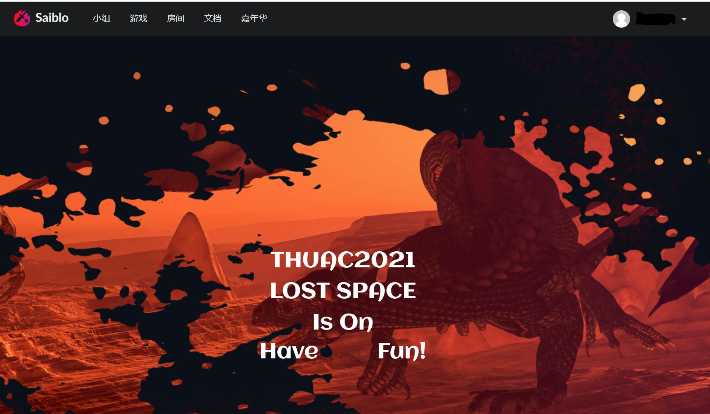
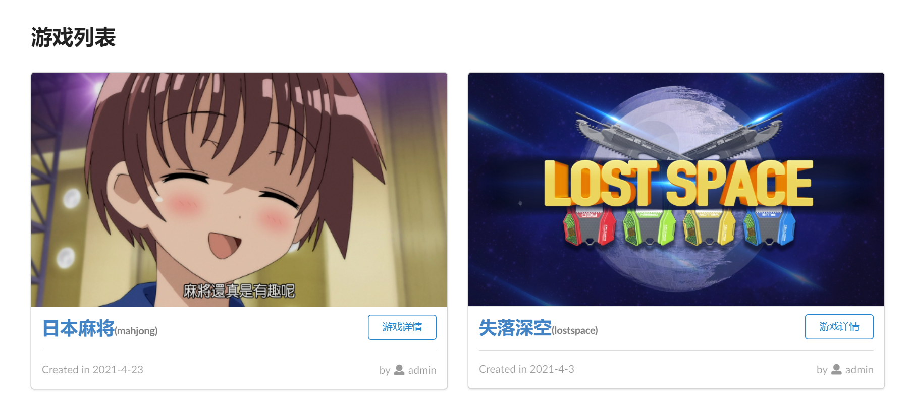
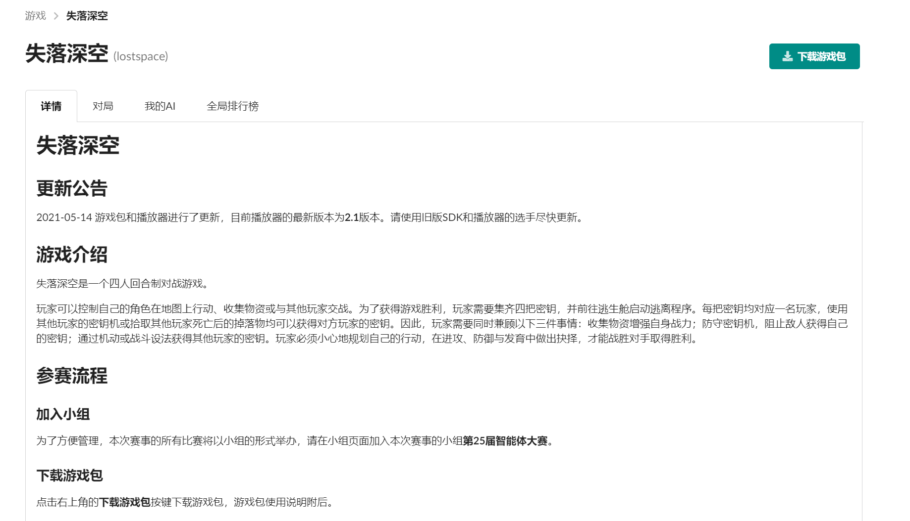
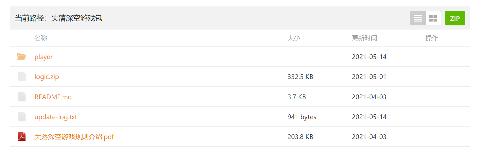
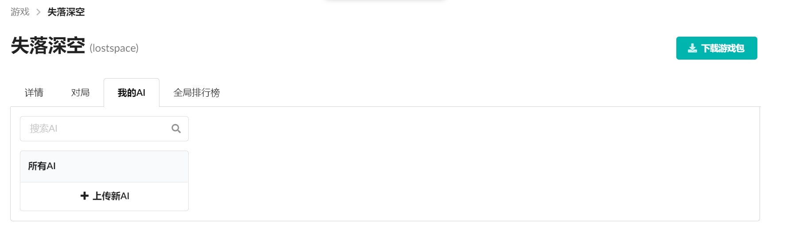
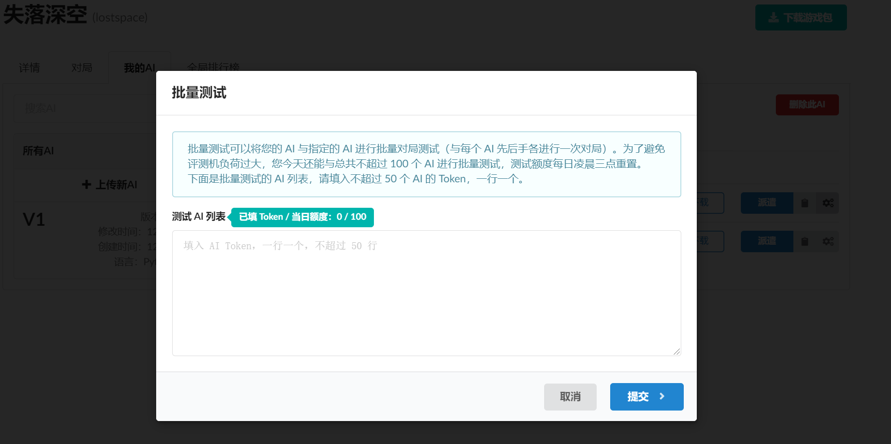
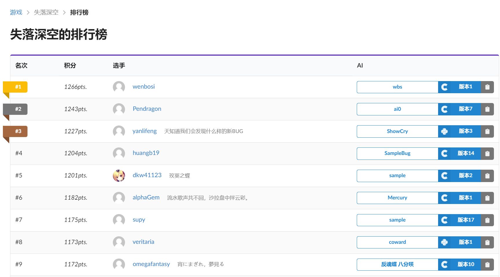

# 用户手册

## 登录和注册

首先输入网址：www.saiblo.net

点击右上角的登录，到达如图界面

如果有账号直接输入用户名和密码即可登录，如果没有的话点击注册。

可以选择用手机号或者邮箱注册。

**如果使用清华邮箱注册，很可能激活邮件会被归入垃圾邮件，请注意**

## 选择游戏

登录后主页会变成这样。此时点击上方导航栏的“游戏”按钮，可以进入游戏界面。

此时会展示游戏列表，选择对应的游戏，单击“游戏详情”进入游戏。

## 进入游戏

这里以“失落深空”为例。

首先可以看到，这里分为“详情”、“对局”、“我的AI”、“全局排行榜”。以及右侧的“下载游戏包”按钮。

对于第一次接触游戏的用户，建议首先阅读一遍“详情”部分，其中对游戏进行了概括性的说明。

然后点击下载游戏包。游戏包里面会对游戏规则以及AI编写方式等进行详细的说明。

## 上传AI

当你写好第一个AI（或者使用一般会提供的DemoAI），为了在Saiblo上进行对局，需要将AI上传。

请点击游戏中“我的AI”一栏。进入后点击“上传新AI”

按照先前在“详情”中给出的上传格式，自己输入名称，并且选择语言类别。点击提交即可上传。

对于一个AI可以有不同的版本。 但AI的语言在创建之后便不能被修改。

对于对应的AI，点击“派遣”就可以让其在全局排行榜中与其他AI对战。

另外两个按钮是“获取token”和“批量测试”。每个AI的每个版本都有一个唯一的token，它可以用来手动创建对局。

## 创建对局

手动测试有两种办法，一个是“批量测试”，一个是创建房间。

### 批量测试

点击批量测试按钮，在其中输入你想对战的AI的token即可进行测试。

### 创建房间

在导航栏点击房间。进入下图界面，在此你可以创建房间或者加入已有的房间。

在房间中为每个玩家选择AI，或者作为人类加入到游戏中。当人满后游戏会开始。

## 查看对局

创建对局后应当会自动跳转到对应的对局详情界面，如果希望手动查看，则可以点击游戏内的“对局”一栏。

在此可以查看游戏所有公开的对局。点击“评测成功”，可以进入查看对局详情。

游戏详情中显示了这场对局的详情，以及各个AI的参数。玩家可以下载回放在本地观看。

## 查看排名

你在“AI”一栏所派遣的AI会自动参加到全局排名中。Saiblo会自动将其与其他AI进行对局，并且计算出分数。在游戏内点击“全局排行榜”一栏可以查看各个AI的成绩。你可以在其中得知自己AI的排名。

